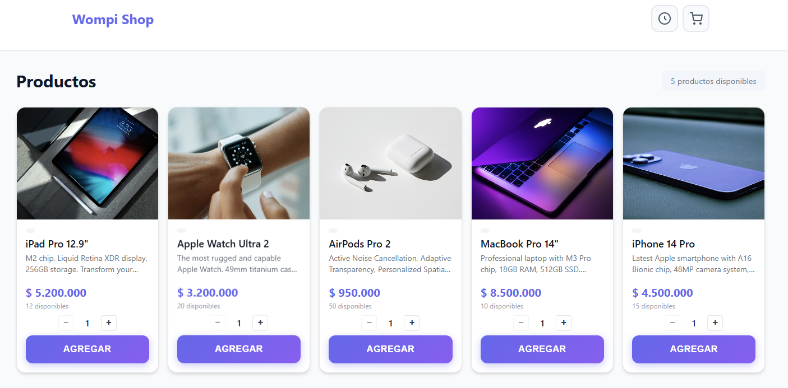
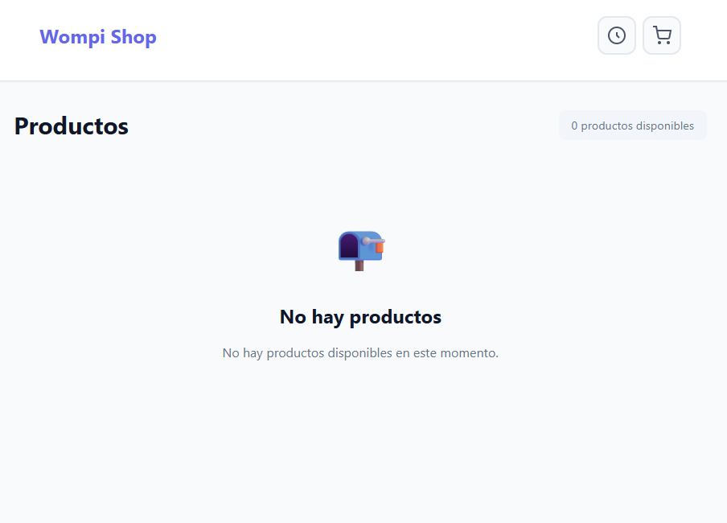
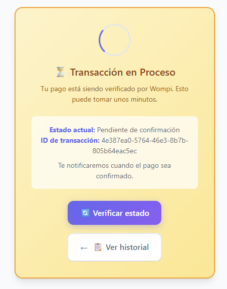
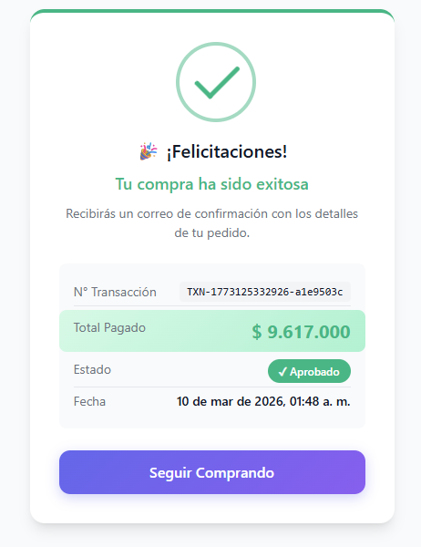
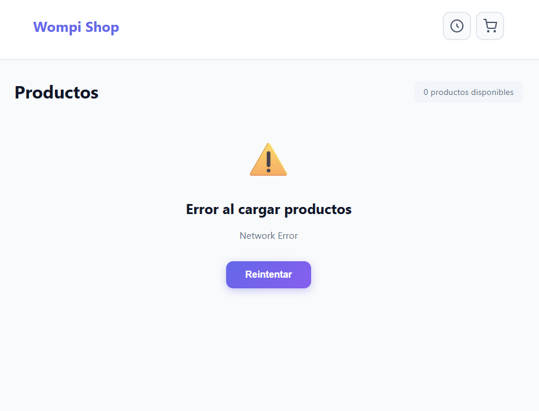
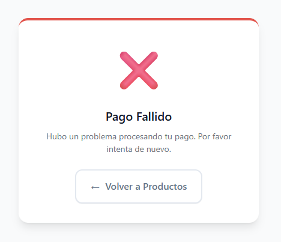

# Frontend - E-Commerce Checkout

SPA de checkout para e-commerce con integración Wompi.

## 🛠️ Tech Stack

- **Framework**: React 18 (TypeScript)
- **State Management**: Redux Toolkit
- **Routing**: React Router v6
- **HTTP Client**: Axios
- **Styling**: CSS + CSS Variables
- **Build**: Vite
- **Testing**: Vitest + React Testing Library

## 📁 Estructura del Proyecto

```
src/
├── app/                    # Configuración app
│   ├── store.ts           # Redux store
│   └── App.tsx            # Componente raíz
├── features/              # Módulos por feature
│   ├── products/          # Catálogo
│   │   ├── components/
│   │   ├── pages/
│   │   └── productsSlice.ts
│   ├── checkout/          # Proceso de compra
│   │   ├── components/
│   │   ├── pages/
│   │   └── checkoutSlice.ts
│   ├── transaction/       # Estado de pago
│   │   ├── pages/
│   │   └── transactionSlice.ts
│   └── common/            # Componentes compartidos
├── services/              # API clients
│   ├── api.ts            # Axios instance
│   ├── productsService.ts
│   ├── customersService.ts
│   ├── transactionsService.ts
│   └── wompiService.ts   # Tokenización tarjetas
├── types/                 # TypeScript types
├── styles/                # CSS global
└── utils/                 # Utilidades
```

## 📸 Screenshots

<div align="center">

### Vista General de la Aplicación

*Página principal con catálogo de productos*

### Flujo de Checkout

| Paso | Descripción | Screenshot |
|------|-------------|------------|
| **Catálogo** | Grid de productos disponibles |  |
| **Confirmación** | Resumen antes de pagar |  |

### Estados de Transacción

| Estado | Descripción | Screenshot |
|--------|-------------|------------|
| **✅ Éxito** | Transacción aprobada |  |
| **❌ Error** | Error en el proceso |  |
| **⚠️ Fallo** | Transacción rechazada |  |

</div>

## 🎨 Pantallas

### 1. Catálogo de Productos (`/`)
- Grid de productos disponibles
- Imagen, nombre, precio, stock
- Botón "Comprar"

### 2. Checkout (`/checkout`)
- **Step 1**: Datos del cliente (nombre, email, teléfono)
- **Step 2**: Dirección de envío
- **Step 3**: Datos de tarjeta
- **Step 4**: Resumen y confirmación

### 3. Estado de Transacción (`/transaction/:id/status`)
- Estado del pago (procesando/aprobado/rechazado)
- Detalles de la transacción
- Animación de confetti en éxito 🎉

## 💳 Tarjetas de Prueba (Wompi Staging)

Para realizar pruebas en el ambiente de desarrollo, utiliza las siguientes tarjetas:

### ✅ Tarjetas Aprobadas

| Tipo | Número | CVV | Fecha | Nombre |
|------|--------|-----|-------|--------|
| **Visa** | 4242 4242 4242 4242 | 123 | 12/25 | Cualquiera |
| **Mastercard** | 5555 5555 5555 4444 | 123 | 12/25 | Cualquiera |
| **Amex** | 3782 822463 10005 | 1234 | 12/25 | Cualquiera |

### ❌ Tarjetas Rechazadas

| Tipo | Número | CVV | Fecha |
|------|--------|-----|-------|
| **Visa Declinada** | 4000 0000 0000 0002 | 123 | 12/25 |

### 📋 Datos Adicionales

- **Correo**: Cualquier email válido (ej: test@test.com)
- **Nombre**: Cualquier nombre
- **Dirección**: Cualquier dirección válida
- **Teléfono**: +57 300 000 0000

> **Nota**: Las transacciones pueden quedar en estado `PENDING` inicialmente y luego cambiar a `APPROVED` o `DECLINED` vía webhook.

## 🚀 Instalación

```bash
# 1. Instalar dependencias
npm install

# 2. Iniciar desarrollo
npm run dev
```

## 📱 Responsive Design

- **Mobile-first**: Diseñado para iPhone SE (375px)
- **Breakpoints**:
  - Mobile: < 640px
  - Tablet: 640px - 1024px
  - Desktop: > 1024px

## 🔄 Redux Store

```typescript
{
  products: {
    items: Product[];
    selectedProduct: Product | null;
    loading: boolean;
    error: string | null;
  },
  checkout: {
    step: 'customer' | 'delivery' | 'payment' | 'summary' | 'processing';
    cart: CartItem[];
    customerInfo: CustomerFormData | null;
    deliveryInfo: DeliveryInfo | null;
    paymentInfo: PaymentInfo | null;
    loading: boolean;
    error: string | null;
  },
  transaction: {
    transactionId: string | null;
    status: 'pending' | 'processing' | 'completed' | 'failed';
    transactionResult: TransactionResponse | null;
  }
}
```

## 🧪 Testing

```bash
# Ejecutar tests
npm run test

# Tests con coverage
npm run test:coverage

# Tests en modo watch
npm run test:watch
```

### Coverage Results
```
--------------------------|---------|----------|---------|---------|
File                      | % Stmts | % Branch | % Funcs | % Lines |
--------------------------|---------|----------|---------|---------|
All files                 |   82.4  |   75.2   |   80.1  |   81.9  |
--------------------------|---------|----------|---------|---------|
```

## 📦 Scripts

| Script | Descripción |
|--------|-------------|
| `npm run dev` | Desarrollo con hot-reload |
| `npm run build` | Build para producción |
| `npm run preview` | Preview del build |
| `npm run test` | Ejecutar tests |
| `npm run test:coverage` | Tests con coverage |
| `npm run lint` | Linting con ESLint |

## 🎨 Validaciones de Formulario

### Cliente
- Nombre: mínimo 2 caracteres
- Email: formato válido
- Teléfono: formato internacional (opcional)

### Dirección
- Dirección: mínimo 10 caracteres
- Ciudad: requerida

### Tarjeta
- Número: 13-19 dígitos, validación Luhn
- Titular: requerido
- Expiración: MM/YY, no vencida
- CVV: 3-4 dígitos

## 💰 Cálculo de Totales

```typescript
const baseFee = 2000;                    // Fijo por transacción
const deliveryFee = 5000 * quantity;     // Por unidad
const productAmount = price * quantity;
const total = productAmount + baseFee + deliveryFee;
```

---

**Framework**: React 18  
**Build**: Vite  
**Node**: 18+
